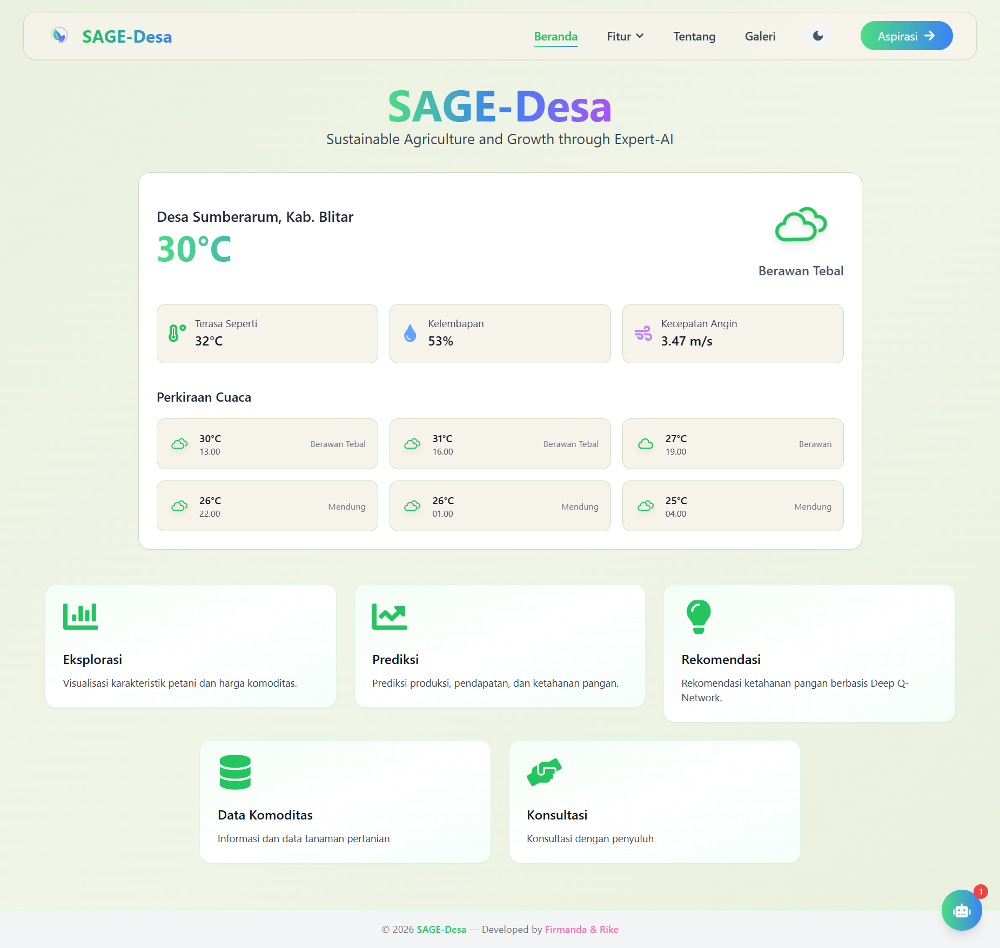
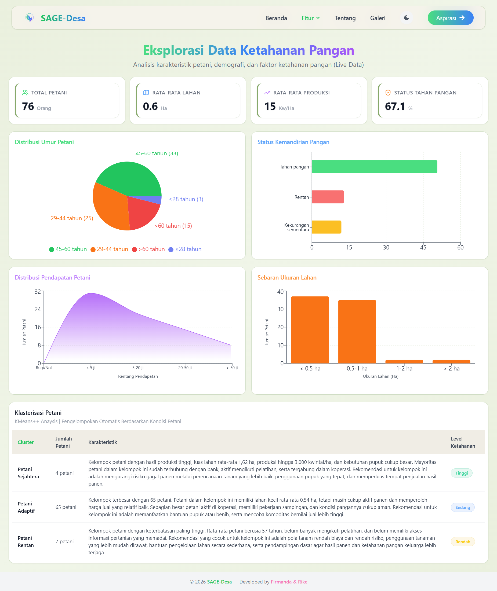
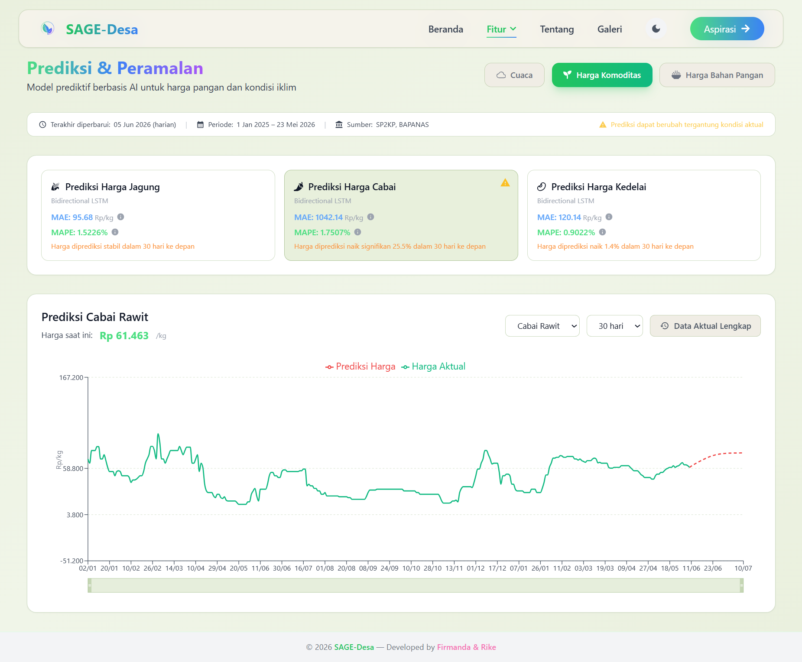
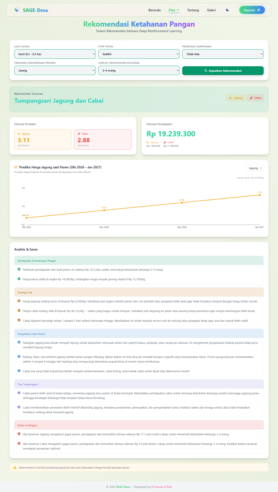

# SAGE-Desa

### Sustainable Agriculture and Growth through Expert AI

SAGE-Desa is a web-based agricultural decision-support dashboard designed for rural farmers in Sumberarum Village, Wates District, Blitar Regency. The application helps users explore agricultural information, view prediction insights, receive crop recommendations, and access AI-assisted guidance through an interactive and user-friendly interface.

This system was developed to support small-scale farmers who often face challenges related to crop selection, market uncertainty, weather conditions, and limited access to data-driven agricultural information. SAGE-Desa presents complex agricultural insights in a simpler and more accessible format so users can better understand local farming conditions and make more informed decisions.

---

## Application Preview

> Add your application screenshots here.

### Home Page


### Exploration Page


### Prediction Page


### Recommendation Page


---

## Key Features

* **Data Exploration**
  Displays visual summaries of farmer characteristics, crop data, and local agricultural conditions.

* **Price and Weather Insights**
  Provides commodity price predictions, food price information, and weather-related insights to support farming decisions.

* **Crop Recommendation**
  Generates crop strategy recommendations based on user input, including estimated production and income.

* **Analysis and Suggestions**
  Presents supporting explanations to help users understand the recommendation results.

* **AI Chatbot**
  Allows users to ask agriculture-related questions through an AI-powered assistant.

* **Consultation and Feedback**
  Provides access to consultation, gallery, and aspiration features to support user interaction and system improvement.


---

## Data Context

SAGE-Desa is designed based on agricultural and food security data related to rural farming conditions in Sumberarum Village. The application considers farmer characteristics, commodity information, weather context, and agricultural decision-making needs to provide more relevant insights for local users.

---

## Tech Stack

### Frontend

* React.js
* Vite
* Tailwind CSS
* Framer Motion

### AI and Data Support

* Predictive AI integration
* Recommendation-based decision support
* AI chatbot assistance
* Interactive dashboard visualization

> Note: AI services, model inference, and private data processing are handled through a separate private service and are not included in this repository.

---

## Getting Started

### Clone the Repository

```bash
git clone https://github.com/username/sage-desa.git
cd sage-desa
```

### Install Dependencies

```bash
npm install
```

### Run the Application

```bash
npm run dev
```

The application will run on:

```bash
http://localhost:5173
```

> Some AI-based features may require access to private services and may not be fully available in the public version of this repository.

---

## Project Purpose

The main purpose of SAGE-Desa is to provide a digital decision-support platform for rural farmers. By combining data visualization, prediction insights, recommendation outputs, and AI-based assistance, the application aims to make agricultural information easier to access, understand, and apply in real farming activities.

SAGE-Desa is expected to support more informed crop planning, improve awareness of market and weather conditions, and help farmers choose farming strategies that are more suitable for their available resources and local context.

---

## Future Development

Several improvements can be considered for future development:

* Expanding the application coverage to more villages or regions
* Improving the user experience for farmers with limited digital literacy
* Optimizing the dashboard for mobile devices
* Developing a Progressive Web App version for easier rural access
* Adding more localized agricultural knowledge
* Strengthening expert validation for recommendation results
